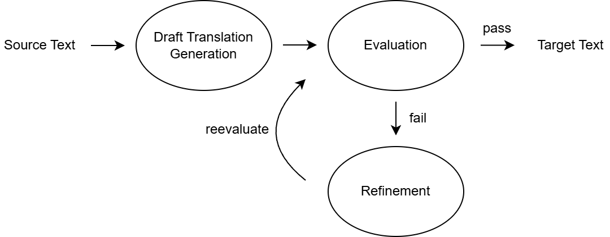

# Agentic Translation Workflow

This repository contains the scripts and methodology for a thesis project analysing the quality of translations produced by a local Large Language Model (default: gemma-3n). The framework uses a multi-agent, iterative workflow to generate, evaluate, and refine translations, providing a rich dataset for qualitative analysis.

## Workflow Graph

<p align="center">
  
</p>

The workflow was inspired by LangChain's [evaluator-optimizer](https://docs.langchain.com/oss/python/langgraph/workflows-agents#evaluator-optimizer), with some twists being:

1. Draft generation and refinement here are treated as separate nodes for a better visualisation, as they use different parameters.[^1] The former uses a higher temperature than the latter.
2. The interaction history may or may not be included via the `--preserve_history` flag. Doing so will generally help making the evaluator more consistent in each iteration.

[^1]: Practically, the two nodes are handled by the same function in the code.

## Requirements

- Python 3.11 or higher (Python 3.14 is untested as of writing).
- Python package: `aiohttp`.
- llama.cpp (llama-server).
- LLM Model: A GGUF-compatible model. The experiments for the thesis were conducted using `unsloth/gemma-3n-E4B-it-GGUF` (Q4_K_M quant).
- Memory:
  - At least 16GB RAM if running on CPU, or
  - 6GB VRAM (NVIDIA GPU recommended).

## Quick Setup (Windows)

These instructions use the [Scoop](https://scoop.sh) package manager for a straightforward setup on Windows.

1. Install Scoop from the official [website](https://scoop.sh).
2. Add `versions` bucket:

```sh
scoop bucket add versions
```

3. Install Python and llama.cpp (Vulkan, or any other variant that your hardware supports):

```sh
scoop install python311 llama.cpp-vulkan
```

4. Install Python dependencies:

```sh
python311 -m pip install aiohttp
```

5. Download the Model: Download the [unsloth/gemma-3n-E4B-it-GGUF](https://huggingface.co/unsloth/gemma-3n-E4B-it-GGUF) model from Hugging Face and place it in the root directory of this project (we use specifically the Q4_K_M quant).

> [!NOTE]
> For other platforms (Linux/macOS): You will need to install Python 3.11 and compile llama.cpp from source according to their official documentation.

## Usage

The experiment is run in three stages: preparing the data, running the LLM server, and executing the main Python script.

##### Step 1: Prepare the corpus

Create a JSON file in the corpus directory (e.g., [corpus/literature.json](corpus/literature.json)). It must have `source_lang`, `target_lang`, `type`, `external_knowledge`, and lastly `texts` containing an array of text objects (`content` and `external_knowledge`).

> [!NOTE]
> Additional keys will be ignored. For example, the `page_on_translated_book` tracks where the passage appears in the translated book. You could embed the translated text directly instead, but doing so might imply that the model needs to see the reference, which it does not.

```json
{
    "source_lang": ...,
    "target_lang": ...,
    "type": ...,
    "external_knowledge": [..., ..., ...],
    "texts": [
        {
            "content": ...,
            "external_knowledge": [..., ..., ...]
        },
        ...
    ]
}
```

##### Step 2: Run the LLM Server

Open a terminal in the project's root directory and run the `llama-server`. This will load the model into memory and open an API endpoint for the script to use.

```sh
# Example command to run llama-server
llama-server -m .\gemma-3n-E4B-it.gguf --port 8000 -c 32768 -fa on --cache-ram 0 --repeat-penalty 1.0 --min-p 0.01 --top-k 64 --top-p 0.95 --no-webui
```

##### Step 3: Run the Experiment Script

Open a second terminal in the project's root directory. Run the `evaluator_optimizer.py` script, pointing it to your input corpus.

```sh
python evaluator_optimizer.py --input "corpus/literature.json" --timeout 0 --iterations 1 --refinement-iterations 3
```

## Output

The script will generate a .csv file in a newly created `evaluator_optimizer_attempts` directory. This CSV file contains a detailed log of every attempt in the refinement loop, allowing for a thorough analysis of the AI's translation products.
